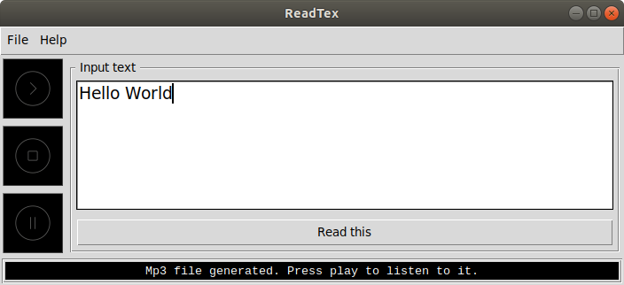

# ReadTex
Text to speech converter and player based on google api. The program has a tkinter gui and is written in python3.

### Prerequisites
In order to excute this code you will need the following python 3 packages:
* tkinter package
```
sudo apt-get install python3-tk
```
* gTTS package
```
sudo pip install gTTS
```

## Tests
This code has been only tested on ubuntu 16.04

## Deployment
This code can be either excuted using a python IDE or by running the following command in the terminal:
```
python3 main.py
```
## Screenshots


## Built With
* [Spyder3](http://pythonhosted.org/spyder/)

## Contributing
If you have any improvement's suggestions, please contact me.

## License
This project is licensed under the MIT License - see the [LICENSE.md](LICENSE.md) file for details

## Acknowledgments
* The nameless heros of Stackoverflow
* Google Text-to-Speech api (https://pypi.org/project/gTTS/)
